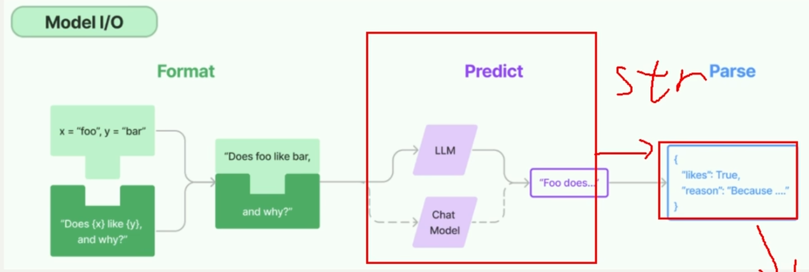

# Model I/O架构

对于整个AI调用，首先需要有询问内容，接着将询问内容传递给大模型，之后获得大模型的回复

> 1. 这里面的询问内容及Format——为提高询问的准确性，提出了提示词工程。将模板与用户需求相结合
> 2. 调用大模型对应Predict——将LLM与大模型对接
> 3. 回复及Parse——对回复的内容进行筛选

## 整体流程（一句话概括）

**用户输入 → 提示词模板（Format）→ 大模型（Predict）→ 输出解析器（Parse）→ 结构化结果**

这三个环节恰好对应了 LangChain 中 `PromptTemplate` / `ChatPromptTemplate`、`ChatModel`、`OutputParser` 三大基础组件。而 `Chain` 或 LCEL（LangChain 表达式语言）则负责把它们串联成一条可维护、可观测的生产级管道。

## 接下来的篇章将分层细化上述内容

下面这张表可以帮你建立全局导航：

| 本节模块        | 对应核心组件                                                          | 详细学习文档                                         | 核心解决什么问题                                |
| ----------- | --------------------------------------------------------------- | ---------------------------------------------- | --------------------------------------- |
| **Format**  | `PromptTemplate`, `ChatPromptTemplate`                          | 6.PromptTemplate总结.md7.ChatPromptTemplate总结.md | 如何把用户问题 + 上下文 + 指令构造成模型能理解的文本或消息列表      |
| **Predict** | `ChatDeepSeek`, `ChatOpenAI` 等                                  | 分散在各文档中（调用示例）                                  | 如何安全、统一地调用大模型 API                       |
| **Parse**   | `StrOutputParser`, `JsonOutputParser`, `PydanticOutputParser` 等 | 8.返回值类型总结.md                                   | 如何从模型的自由文本中提取出程序可用的结构化数据                |
| **串联编排**    | `Chain`（传统）与 LCEL（新式）                                           | 9.Chains知识总结.md                                | 如何把 Format → Predict → Parse 连成一条可靠的流水线 |

***

## 一、提示词工程（Format）

提示词工程包括**模板的搭建**和**内容的填充**。

1. **模板的搭建**
   - `PromptTemplate`：适用于单条纯文本提示，返回字符串。
   - `ChatPromptTemplate`：适用于多轮、多角色对话（system / human / ai），返回消息列表。
2. **内容的填充**
   - `format()`：返回普通字符串（调试、旧代码）。
   - `invoke()`：返回 `PromptValue` 对象，能被 LangChain 生态自动转换，推荐生产使用。

> 📖 **详细内容**：见 [6.PromptTemplate总结.md](./6.PromptTemplate总结.md) 和 [7.ChatPromptTemplate总结.md](./7.ChatPromptTemplate总结.md)\
> 你会学到两种模板的创建方式、`format` vs `invoke` 的区别、以及如何用 `MessagesPlaceholder` 动态注入聊天历史。

## 二、调用大模型（Predict）

使用 `ChatModel`（如 `ChatDeepSeek`、`ChatOpenAI`）封装 API 密钥、模型名等配置。调用时只需传入提示词（字符串或消息列表），模型返回一个 `AIMessage` 对象（内含 `content` 属性）。

- 单次调用：`llm.invoke(prompt)`
- 流式调用：`llm.stream(prompt)`
- 异步调用：`llm.ainvoke(prompt)`

> 📖 **详细内容**：在后续文档（6、7、8、9）的代码示例中都会出现 Predict 环节，尤其注意 `BaseChatModel` 与旧版 `BaseLLM` 返回值的差异，详见 [8.返回值类型总结.md](./8.返回值类型总结.md)。

## 三、输出解析器（Parse）

大模型返回的 `AIMessage` 往往是一段自然语言。输出解析器的作用是**提取其中真正有用的信息**，甚至强制模型输出 JSON、XML、枚举值等固定格式。

常用解析器：

| 解析器                    | 输出类型               | 适用场景                    |
| ---------------------- | ------------------ | ----------------------- |
| `StrOutputParser`      | 纯字符串               | 直接取 `AIMessage.content` |
| `JsonOutputParser`     | Python dict / list | 要求模型返回 JSON             |
| `PydanticOutputParser` | Pydantic 对象        | 强类型校验 + 字段描述 + 枚举约束     |
| `OutputFixingParser`   | 同上                 | 解析失败时用另一个模型自动修复         |
| `RetryOutputParser`    | 同上                 | 解析失败时用原模型重试             |

> 📖 **详细内容**：见 [8.返回值类型总结.md](./8.返回值类型总结.md)\
> 你会搞懂 `.content` 和 `.to_string()` 的区别、`StrOutputParser` 为什么是 LCEL 链的常客，以及 `PydanticOutputParser` 如何为 Agent 提供类型安全的行动指令。
>

